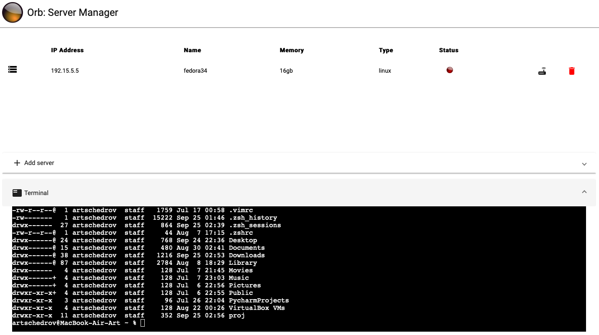

<h1 align="center">
<a href="#"></a><br />
Orb
</h1>
<p align="center"><strong>Very simple server manager</strong>.</p>

## About
Orb is a web server manager, with ping and terminal support.

<a href="#"></a><br />
## Install
You can run this with the commands
``` shell
git clone https://github.com/artschedrov/orb.git
cd orb
bash run.sh
```
## License
This software is licensed under MIT. See the [LICENSE.md](https://github.com/artschedrov/orb/blob/main/LICENSE) file for more information.
